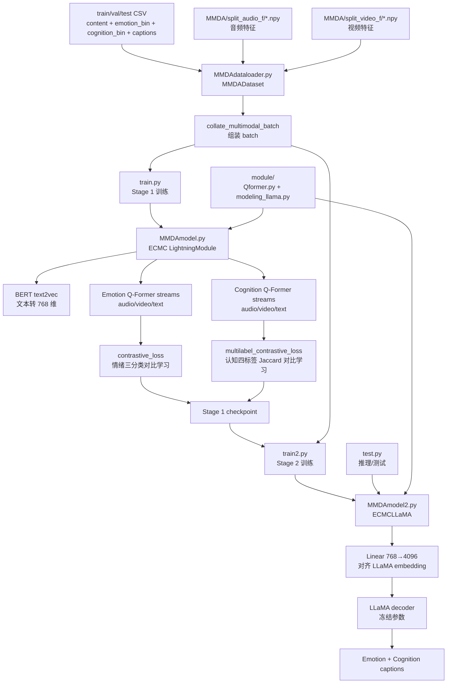

# ECMC 项目 AI 上下文

更新时间：2026-06-28 10:32:19

## 必须遵守的回答规则

1. **必须用代码或论文原文佐证**：回答任何问题时，必须引用代码中的具体文件名、行号、变量名，或论文中的原话/公式作为证据。例如："在 `MMDAmodel.py:230` 的 `contrastive_loss` 函数中，使用了……"、"论文第 3 页公式 (10) 说明了……"。不允许凭印象或推测回答，必须有据可查。
2. **面向深度学习初学者的通俗解释**：用户是深度学习领域纯小白，回答时需要：
   * **用生活化的类比解释核心概念（例如："Q-Former 就像一个'信息提炼器'，把冗长的原始特征压缩成关键要点"）**
   * **首次出现的专业术语必须附带括号解释，例如：****对比学习（Contrastive Learning，一种让相似数据靠近、不相似数据远离的训练方法）**
   * **避免一上来就甩公式，先用文字描述直觉，再用公式辅助说明**
   * **解释"为什么这样做"比"怎么做"更重要**

## 项目定位

ECMC 是 AAAI 2026 论文 **Voices, Faces, and Feelings: Multi-modal Emotion-Cognition Captioning for Mental Health Understanding** 的代码仓库。论文提出 Emotion–Cognition Multi-modal Captioning，即从临床访谈中的文本、音频、视频多模态信息生成情绪与认知状态描述，用于提升心理健康理解与辅助诊断的可解释性。

论文核心依据：

- 论文摘要和 Introduction：ECMC 任务生成 emotion–cognition profiles，提升心理健康评估准确性和可解释性。
- 论文 Method / Model Architecture：模型采用 encoder–decoder 架构，模态编码器后接 dual-stream BridgeNet，再接 LLaMA 解码器。
- 论文公式 (1)：视频、音频、文本分别编码为 `Hv, Ha, Ht`。
- 论文公式 (2)：BridgeNet 输出情绪表示 `he` 与认知表示 `hc`。
- 论文公式 (3)：LLaMA 输入为 `<BOS> + he + hc + Prompt`。
- 论文公式 (10)：情绪对比学习损失。
- 论文公式 (11)(12)：基于 Jaccard 相似度的认知多标签对比学习损失。
- 论文公式 (13)(14)：两阶段训练，第一阶段 `L1 = Lemo + Lcog`，第二阶段使用 caption 交叉熵损失。

## 代码架构总览

## 文件与模块索引

| 路径                                              | 角色                                                      | 关键依据                                                                     |
| ------------------------------------------------- | --------------------------------------------------------- | ---------------------------------------------------------------------------- |
| [README.md](README.md)                               | 项目说明，概述 ECMC 任务、模型框架和论文标题              | 第 3-8 行说明 ECMC 框架、dual-stream BridgeNet、LLaMA decoder                |
| [MMDAdataloader.py](MMDAdataloader.py)               | MMDA 数据读取、标签解析、特征 padding、batch 组装         | `MMDADataset`、`MultilabelBalancedSampler`、`collate_multimodal_batch` |
| [MMDAmodel.py](MMDAmodel.py)                         | Stage 1：ECMC 主模型，Q-Former 双流特征提取和对比学习损失 | 对应论文公式 (2)(10)(11)(12)(13)                                             |
| [MMDAmodel2.py](MMDAmodel2.py)                       | Stage 2：继承 ECMC，接入冻结 LLaMA 生成 caption           | 对应论文公式 (3)(14)                                                         |
| [train.py](train.py)                                 | Stage 1 训练入口                                          | 训练 `ECMC`，batch_size=64，保存到 `checkpoints`                         |
| [train2.py](train2.py)                               | Stage 2 训练入口                                          | 加载 Stage 1 checkpoint，使用 DeepSpeed 训练 `ECMCLLaMA`                   |
| [test.py](test.py)                                   | 测试/推理入口                                             | 加载 `ECMCLLaMA` 和测试集，调用 Lightning `trainer.test`                 |
| [module/Qformer.py](module/Qformer.py)               | Q-Former/BERT 改造实现                                    | 支持 `query_embeds` 与 cross-attention                                     |
| [module/modeling_llama.py](module/modeling_llama.py) | 本地 LLaMA 实现                                           | 为 `LlamaForCausalLM` 提供 decoder 能力                                    |
| [ds_config.json](ds_config.json)                     | DeepSpeed ZeRO-2 配置                                     | Stage 2 使用                                                                 |
| [environment.yml](environment.yml)                   | Conda 环境依赖                                            | Python 3.10、PyTorch、Lightning、Transformers、DeepSpeed 等                  |
| [show_data.py](show_data.py)                         | 小型张量展示脚本                                          | 用随机张量展示 hidden state 形状与相似度                                     |

## 运行与训练流程

### Stage 1：训练 BridgeNet 的情绪/认知表示

入口：[train.py](train.py)

流程：

1. 创建 `ECMC()`。
2. 使用 [MMDAdataloader.py](MMDAdataloader.py) 读取 `train.csv` 和 `val.csv`。
3. 输入包括：
   - `text`：访谈文本；
   - `audio`：`.npy` 音频特征，默认 padding/truncate 到 `(1024, 768)`；
   - `video`：`.npy` 视频特征，训练入口设为 `(512, 768)`；
   - `emotion_bin`：情绪标签，代码中按整数处理；
   - `cognition_bin`：四维认知多标签。
4. [MMDAmodel.py](MMDAmodel.py) 中分别用情绪 Q-Former 和认知 Q-Former 提取表示。
5. 损失为 `contrastive_loss + multilabel_contrastive_loss`，对应论文第一阶段 `L1 = Lemo + Lcog`。

### Stage 2：接入 LLaMA 生成情绪-认知 caption

入口：[train2.py](train2.py)

流程：

1. 创建 `ECMCLLaMA()`。
2. 加载 Stage 1 checkpoint。
3. 冻结 LLaMA 参数。
4. 将情绪/认知 Q-Former 输出通过 `Linear(768, 4096)` 投影到 LLaMA embedding 空间。
5. 拼接 `BOS + 多模态 embedding + prompt + caption text embeddings`。
6. 用 LLaMA 的语言建模 loss 训练可训练部分，对应论文第二阶段 `L2 = CELoss`。

## 数据约定

代码期望存在以下数据/权重，当前仓库未包含完整数据与大模型权重：

- `train.csv`、`val.csv`、`test.csv`
- `MMDA/split_audio_f/*.npy`
- `MMDA/split_video_f/*.npy`
- `weights/`：BERT/text2vec/Q-Former/LLaMA 等预训练权重路径，代码中多处默认使用该目录
- `pytorch_model.bin`：Q-Former 初始化权重，代码在 [MMDAmodel.py](MMDAmodel.py) 中读取
- Stage 1 checkpoint：在 [train2.py](train2.py) 中用 `./checkpoints/your_ckpt` 占位
- Stage 2 checkpoint：在 [test.py](test.py) 中用 `your.ckpt` 占位

## 重要代码-论文对应关系

| 论文内容                              | 代码位置                                                       | 说明                                                                    |
| ------------------------------------- | -------------------------------------------------------------- | ----------------------------------------------------------------------- |
| 公式 (1)：三模态初始表示              | [MMDAdataloader.py](MMDAdataloader.py)、[MMDAmodel.py](MMDAmodel.py) | 当前代码直接读取预提取 `.npy` 音频/视频特征，文本用 BERT 编码         |
| 公式 (2)：BridgeNet 输出情绪/认知表示 | [MMDAmodel.py](MMDAmodel.py)                                      | 情绪流和认知流各自包含 audio/video/text 三个 Q-Former                   |
| Q-Former query + cross-attention      | [module/Qformer.py](module/Qformer.py)、[MMDAmodel.py](MMDAmodel.py) | `query_embeds` 作为可学习 query，`encoder_hidden_states` 接模态特征 |
| 公式 (10)：情绪对比学习               | [MMDAmodel.py](MMDAmodel.py)                                      | `contrastive_loss`                                                    |
| 公式 (11)(12)：认知多标签对比学习     | [MMDAmodel.py](MMDAmodel.py)                                      | `multilabel_contrastive_loss`，内部计算标签集合 Jaccard 相似度        |
| 公式 (13)：第一阶段训练               | [train.py](train.py)、[MMDAmodel.py](MMDAmodel.py)                   | `forward` 返回 `emo_loss + cog_loss`                                |
| 公式 (3)：LLaMA 输入拼接              | [MMDAmodel2.py](MMDAmodel2.py)                                    | `bos_embeds + mm_input + prompts_embeds`，训练时再加 `text_embeds`  |
| 公式 (14)：caption CE loss            | [MMDAmodel2.py](MMDAmodel2.py)                                    | 调用 `LlamaForCausalLM(... labels=targets)` 返回 `outputs.loss`     |

## 开发与回答注意事项

- 这是研究代码，不是完整工程化产品；很多路径是占位或依赖外部大文件。
- 不要轻易运行完整训练，Stage 1/2 需要 GPU、数据集和大模型权重。
- 若用户问“为什么这么写”，优先找：
  1. 当前代码实现；
  2. 论文 Method、公式、表格；
  3. README 的项目说明。
- 若代码与论文不完全一致，要明确区分“论文设计”和“当前代码实现”。例如论文提到 VideoMAE/HuBERT/BERT 作为模态编码器，但当前代码主要读取已经提取好的 `.npy` 音频/视频特征，文本再用 BERT/text2vec 编码。
- 给深度学习小白解释时，可将 Q-Former 类比为“一组会提问的探针”，从很长的音频/视频/文本特征里提炼重点。

## 模块文档

- [module/CLAUDE.md](module/CLAUDE.md)：Q-Former 与 LLaMA 本地模型实现说明。
